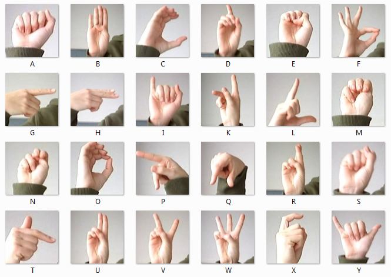

# Sign Language MNIST Classification with PyTorch Lightning

  
*Пример изображений из датасета Sign Language MNIST*

Проект реализует классификатор изображений жестового языка (ASL) на основе датасета Sign Language MNIST с использованием PyTorch Lightning.

## 📌 Особенности проекта

- 🚀 Реализация на PyTorch Lightning для чистого и модульного кода
- 🏎️ Оптимизация для GPU с поддержкой Tensor Cores
- 📊 Интеграция с ClealML для трекинга экспериментов
- 🧩 Готовность к масштабированию (multi-GPU/TPU)
- 🔍 Логирование метрик: F Beta Score, AUROC, False Discovery Rate
- 🚀 Использование callbacks: EarlyStopping, ModelCheckpoint

## 📦 Установка

1. Клонируйте репозиторий:
```bash
git clone https://github.com/yourusername/sign-language-mnist.git
cd sign-language-mnist
```
2. Установите зависимости.
```bash
pip install -r requirements.txt
```
3. Загрузите датасет.
```bash
./load_csv.sh
```
## 🏃 Запуск обучения

Базовый вариант (CPU/GPU):
```bash
python m2.1_lightning.py
```
С продвинутыми опциями: <br>
`--fast_dev_run: bool` - единичный тестовый прогон<br>
`--epochs: int` - колличество эпох обучения
```bash
python m2.1_lightning.py --fast_dev_run True
python m2.1_lightning.py --epochs 20
```
## 🧠 Архитектура модели
```python
class ASLClassifier(LightningModule):
    def __init__(self):
        self.block1 = nn.Sequential( # (bacth, 1, 28, 28)
            nn.Conv2d(1, 8, 3),
            nn.BatchNorm2d(8), #(batch, 8, 28, 28)
            nn.AvgPool2d(2), #(batch, 8, 14, 14)
            nn.ReLU(),
        )
        self.block2 = nn.Sequential(
            nn.Conv2d(8, 16, 3),
            nn.BatchNorm2d(16), #(batch, 16, 14,14)
            nn.AvgPool2d(2), #(batch, 16, 7, 7)
            nn.ReLU(),
        )
        self.lin1 = nn.Linear(784, 100) #(batch, 100)
        self.act1 = nn.LeakyReLU()
        self.drop1 = nn.Dropout(p=.3)
        self.lin2 = nn.Linear(100, 25)
```
## 📊 Результаты

| Метрика            | Train   | Val     | Test    |
|--------------------|---------|---------|---------|
| Accuracy           | 91.4%   | 90.8%   | 92.3%   |
| Loss               | 0.445   | 0.001   | 0.276   |


## 🛠️ Технологический стек
   * PyTorch Lightning
   * TorchMetrics
   * ClearML
  
## 📜 Лицензия
Этот проект распространяется под лицензией MIT.